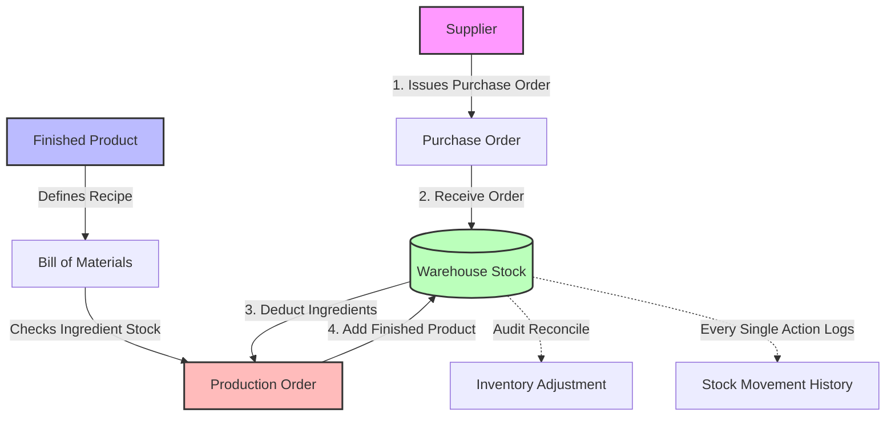

# Invynite — Intelligent Material Requirements Planning & Inventory Engine

[](https://dotnet.microsoft.com/)
[](https://learn.microsoft.com/en-us/ef/core/)
[](https://scalar.com/)
[](https://opensource.org/licenses/MIT)

**Invynite** is a Material Requirements Planning (MRP) and Inventory Management Web API. Built on a clean, onion-inspired architecture using ASP.NET Core and Entity Framework Core, it streamlines the lifecycle of products—from procuring raw materials to managing assembly recipes (Bills of Materials), handling manual stock adjustments, executing production lines, and auditing stock movements.

---

## Executive Summary & Concept Flow

To a person without a technical or manufacturing background, **Invynite** is like a **digital warehouse controller and digital kitchen manager** combined. 

1. **Procurement**: You buy raw ingredients (Materials) from vendors (Suppliers) via a *Purchase Order*. When the truck arrives at your building (Warehouse), you check them in.
2. **Stockroom**: The system records exactly how much of each ingredient you have. If stock levels drop too low, it rings an alarm (*Low Stock Alerts*).
3. **Recipe Book**: You teach the system how to build your items (Products) by creating a *Bill of Materials (BOM)*. For example, a "Chair" needs 5kg of Steel, 1 Liter of Paint, and 20 Screws.
4. **Kitchen/Production**: You order the assembly line to produce 10 Chairs. The system automatically inspects your inventory, calculates if you have enough ingredients, warns you if you are short, deducts the raw materials from the stockroom, and finally registers 10 brand-new Chairs in your finished goods inventory.
5. **Auditing**: Every single time stock goes in or out—whether from production, purchase receipts, or manually adjusting a broken item—the system files a permanent, timestamped *Stock Movement Log*.

Here is a visual workflow diagram representing the system flow:



---

## Core Features

*   **Inventory & Master Data Management**: Maintain clean catalogs of materials (raw items measured in Kg, Liters, Pieces) and finished products (with unique SKUs) across multiple warehouses.
*   **Bill of Materials (BOM) Engine**: Create, update, and manage manufacturing recipes. It includes a built-in **Requirement Calculator** to simulate whether you have sufficient stock to produce a certain quantity of a product before actually committing.
*   **Vendor Procurement (Purchase Orders)**: Generate and track supplier invoices/purchases. Transition orders from `Pending` to `Received`, automatically increasing raw stock and logging movements when the shipment is delivered to a warehouse.
*   **Automated Production Line**: Execute manufacturing jobs. Invynite checks the BOM recipe, verifies stock availability, performs a synchronized transaction to deduct ingredients, creates the finished product, and updates inventory in a single atomic database process.
*   **Stock Adjustments & Reconciliation**: Perform manual warehouse audits. If items are lost, damaged, or physically counted differently, enter an adjustment with written justifications to re-sync the system.
*   **Continuous Audit Log (Stock Movements)**: Log every incoming and outgoing item dynamically with movement types (`IN` / `OUT`) and traceable reference IDs. Includes pagination, sorting, and keyword searching.

---

## Clean Onion-Inspired Architecture

Invynite follows a modern, highly structured directory layout separating concerns, ensuring the code is maintainable, highly testable, and robust.

```
Invynite/
├── Domain/                       # Core Enterprise Concepts & Logic
│   ├── Entities/                 # Domain Database Models (BOM, Inventory, Master, Production, Purchasing)
│   └── Enums/                    # Status and Action Enumerations (MovementType, ProductionStatus, etc.)
├── Infrastructure/               # External Operations & Database Access
│   └── Data/                     # EF Core DbContext, Configurations, and Development Seeder
├── Middlewares/                  # HTTP Pipeline Interceptors (Global Exception Handlers)
├── Services/                     # Business Logic Layers (BOM, Inventories, Procurement, Productions)
│   ├── BOM/                      # Recipes and calculations logic & DTOs
│   ├── Inventories/              # Product, Material, and Adjustment logics
│   ├── Procurement/              # Purchase order and vendor processing
│   └── Productions/              # Production execution and stock tracking
└── Controllers/                  # API Controllers exposing HTTP Endpoints
```

---

## API Reference & Usage Guide

Below is a concise guide to using each endpoint in Invynite. All routes are prefixed with `/api`.

### 1. Finished Product Management (`/api/inventories/Product`)

Allows you to manage the finished goods catalog.

*   **`GET /api/inventories/Product`**
    *   **Description**: Fetch all finished products. Supports search, sorting, and pagination.
    *   **Query Parameters**: `searchTerm` (string), `sortColumn` (string: `name`, `sku`, `uom`), `sortOrder` (string: `asc`, `desc`), `page` (int), `pageSize` (int)
    *   **Response**: List of products, each displaying its aggregate stock across all warehouses.

*   **`GET /api/inventories/Product/{prodId}`**
    *   **Description**: Get comprehensive details of a single product, including its specific stock breakdown in each warehouse.

*   **`POST /api/inventories/Product`**
    *   **Description**: Add a new finished product to the system.
    *   **Request Body**:
        ```json
        {
          "name": "Luxury Wooden Table",
          "sku": "TBL-099",
          "unitOfMeasure": "Pieces"
        }
        ```

*   **`PUT /api/inventories/Product/{prodId}`**
    *   **Description**: Update product information (Name, SKU, Unit of Measure).

*   **`DELETE /api/inventories/Product/{prodId}`**
    *   **Description**: Remove a product from the database.
    *   *Note*: The system will throw a validation error if the product still has active stock in any warehouse to prevent database inconsistency.

---

### 2. Raw Material Management (`/api/inventories/Material`)

Manages the raw ingredients used in the manufacturing recipes.

*   **`GET /api/inventories/Material`**
    *   **Description**: Get raw materials with paginated search and sorting capabilities.

*   **`GET /api/inventories/Material/{matId}`**
    *   **Description**: Retrieve material details and a list of warehouses storing it.

*   **`POST /api/inventories/Material`**
    *   **Description**: Create a raw material ingredient.
    *   **Request Body**:
        ```json
        {
          "name": "Oak Timber",
          "unitOfMeasure": "Kg"
        }
        ```

*   **`PUT /api/inventories/Material/{matId}`**
    *   **Description**: Modify material parameters.

*   **`DELETE /api/inventories/Material/{matId}`**
    *   **Description**: Remove an ingredient. Only allowed if total stock is currently `0`.

*   **`GET /api/inventories/Material/low-stock-alert`**
    *   **Description**: Instantly sweeps the inventory databases and highlights any raw materials with a quantity of **`10` or lower** in any warehouse, listing exactly where they are low.

---

### 3. Bill of Materials / Recipe Management (`/api/BillOfMaterial`)

Defines the core manufacturing formulas.

*   **`POST /api/BillOfMaterial`**
    *   **Description**: Map raw material requirements to a product. A product can only have one active BOM configuration.
    *   **Request Body**:
        ```json
        {
          "productId": 1, 
          "recipes": {
            "1": 5.0,  // Material ID 1: Requires 5.0 units
            "2": 1.5,  // Material ID 2: Requires 1.5 units
            "3": 20.0  // Material ID 3: Requires 20.0 units
          }
        }
        ```

*   **`GET /api/BillOfMaterial/{prodId}`**
    *   **Description**: Fetch the recipe breakdown for a product, showing required ingredient quantities and units.

*   **`PUT /api/BillOfMaterial/{prodId}`**
    *   **Description**: Completely replace the recipe list and quantities for a product.

*   **`DELETE /api/BillOfMaterial/{prodId}`**
    *   **Description**: Delete a product's BOM recipe.

*   **`GET /api/BillOfMaterial/count/pid={prodId}&qty={quantity}`**
    *   **Description**: **Requirement Simulator**. Input a target production quantity, and the system simulates the exact raw materials required, displays current stock levels, calculates the shortfalls (shortages), and returns a boolean value indicating whether you can safely initiate production.
    *   **Response Model**:
        ```json
        {
          "productId": 1,
          "productName": "Chair",
          "quantityToProduce": 10,
          "materials": [
            {
              "materialId": 1,
              "materialName": "Steel",
              "quantityRequired": 50,
              "currentStock": 120,
              "shortage": 0,
              "isSufficient": true
            },
            {
              "materialId": 2,
              "materialName": "Paint",
              "quantityRequired": 10,
              "currentStock": 3,
              "shortage": 7,
              "isSufficient": false
            }
          ]
        }
        ```

---

### 4. Procurement & Purchase Orders (`/api/PurchaseOrder`)

Handles replenishing stock of raw ingredients from external vendors.

*   **`POST /api/PurchaseOrder`**
    *   **Description**: Draft a new Purchase Order to buy ingredients. The order starts in `Pending` status.
    *   **Request Body**:
        ```json
        {
          "supplierId": 1,
          "purchaseOrderItems": [
            { "materialId": 1, "quantity": 100, "unitPrice": 15.50 },
            { "materialId": 2, "quantity": 50, "unitPrice": 8.00 }
          ]
        }
        ```

*   **`POST /api/PurchaseOrder/receive/pid={purchaseOrderId}&wid={warehouseId}`**
    *   **Description**: **Check-In Shipment**. Registers that a pending purchase order has arrived at the selected warehouse. Automatically increases the physical inventory of the raw materials, issues `IN` stock movement logs, and changes the order status to `Received`.

*   **`GET /api/PurchaseOrder`**
    *   **Description**: Returns a historic timeline of all purchase orders, showing vendors, order dates, and status.

---

### 5. Manufacturing Operations (`/api/ProductionOrder`)

Triggers the actual creation of finished items.

*   **`POST /api/ProductionOrder/production-orders`**
    *   **Description**: Run production for a product. Under the hood:
        1. Checks the product's BOM.
        2. Inspects warehouse stock levels for ingredients.
        3. If there is a shortage, it blocks execution and throws `InsufficientStockException`.
        4. If stock is sufficient, it deducts materials, adds finished products, records multiple `IN` & `OUT` stock movement trails, and commits everything in a single, safe transaction.
    *   **Request Body**:
        ```json
        {
          "productId": 1,
          "quantityToProduce": 5,
          "warehouseId": 1
        }
        ```

*   **`GET /api/ProductionOrder`**
    *   **Description**: Retrieve full history of production runs.

*   **`GET /api/ProductionOrder/{orderId}`**
    *   **Description**: View details of a specific production order.

---

### 6. Physical Inventory Adjustments (`/api/InventoryAdjustment`)

Reconciles physical inventory discrepancies (damage, loss, manual stock counts).

*   **`POST /api/InventoryAdjustment`**
    *   **Description**: Reconciles warehouse stock for a material. If actual physical stock is lower, it adjusts stock and logs an `OUT` movement; if higher, it logs an `IN` movement.
    *   **Request Body**:
        ```json
        {
          "warehouseId": 1,
          "materialId": 1,
          "newQuantity": 95.0,
          "reason": "Damaged timber discarded during stock count audit"
        }
        ```

*   **`GET /api/InventoryAdjustment`**
    *   **Description**: Lists all audit adjustments made by warehouse administrators, showing previous vs new quantities and justifications.

---

### 7. Stock Movement Audits (`/api/StockMovement`)

*   **`GET /api/StockMovement`**
    *   **Description**: Exposes a detailed transaction log of *every* inventory modification. Filter by search terms, sort by columns, and page through entries to trace any warehouse transaction.

---

## Tech Stack

*   **Runtime Environment**: `.NET 10.0 / .NET 9.0 SDK`
*   **Database Engine**: `SQL Server` (via Entity Framework Core with automatic SQL Migrations)
*   **Modern API Documentation Docs**: Exposes **Scalar Interactive API Reference** and **Swagger UI** for testing endpoints directly.

---

## Getting Started

Follow these steps to run the Invynite API server locally:

### Prerequisites
1. Install the latest [.NET SDK](https://dotnet.microsoft.com/download).
2. Install [Microsoft SQL Server LocalDB](https://learn.microsoft.com/en-us/sql/database-engine/configure-windows/sql-server-express-localdb) or a full SQL Server instance.

### Installation & Configuration
1. Clone the repository.
2. Navigate to the project configuration directory (`Invynite/`) and locate `appsettings.json`.
3. Modify the connection string under `DefaultConnection` if you use a customized SQL Server instance:
   ```json
   "ConnectionStrings": {
     "DefaultConnection": "server=localhost;database=invynite;Trusted_Connection=true;TrustServerCertificate=true"
   }
   ```

### Running the Application
Open your terminal inside the project directory and run:

```bash
dotnet run
```

When the application boots:
*   The database is cleared, rebuilt with correct relationships, and fully seeded with mock data.
*   The API server starts listening.
*   **Swagger API UI**: Open `https://localhost:7163/index.html` (or your console-allocated port) in your browser.
*   **Scalar Interactive UI**: Open `https://localhost:7163/scalar` in your browser.
